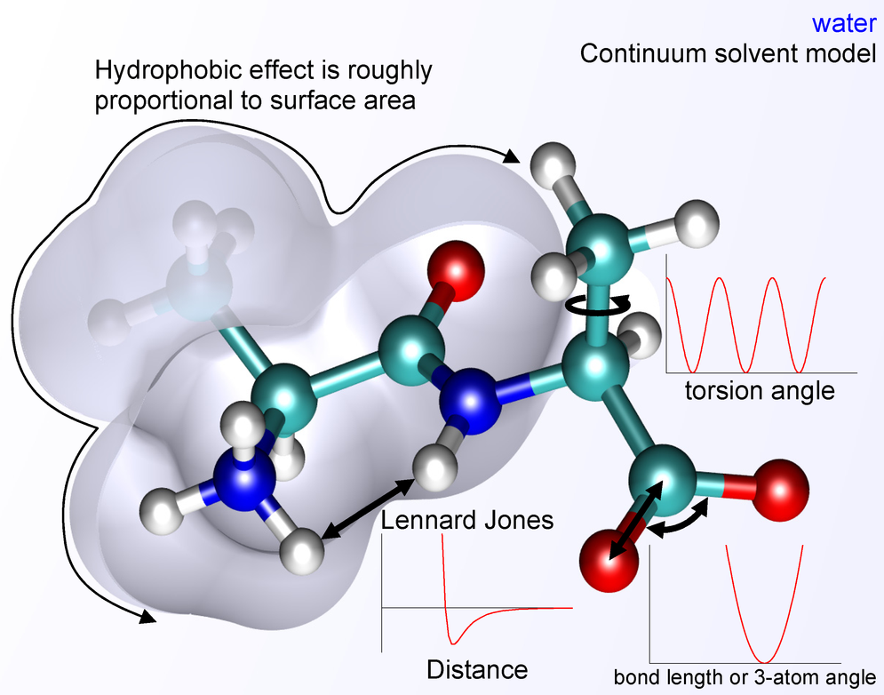
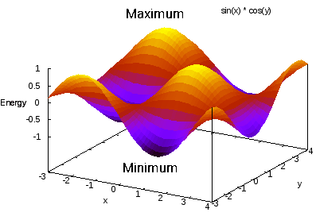
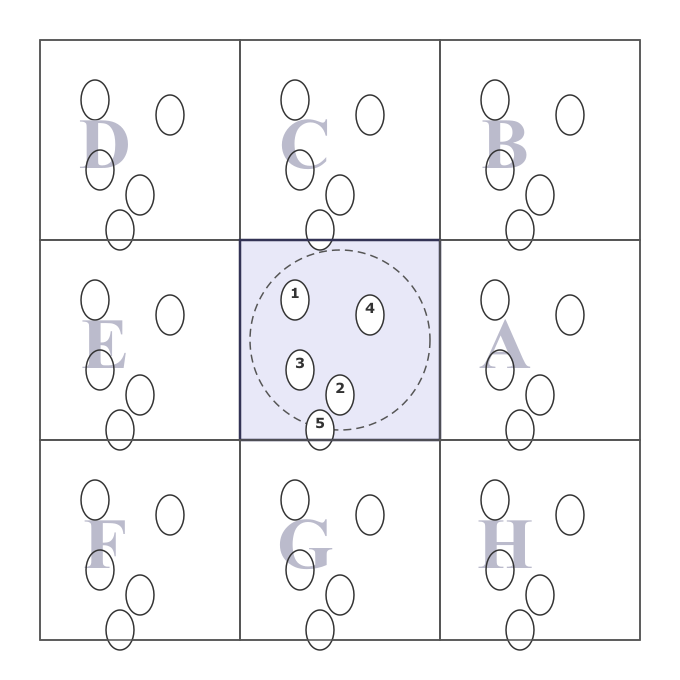

# Classical molecular dynamics simulations

# Computational Chemistry — MD Simulations

**Instructor:** P. Ojeda-May, pedro.ojeda-may@umu.se  
**Affiliation:** High Performance Computing Center (HPC2N), Umeå University


## Table of Contents

1. [Particle Dynamics and Newton's Equation](#1-particle-dynamics-and-newtons-equation)
2. [Protein Conformational Space](#2-protein-conformational-space)
3. [Historical Context and Applications](#3-historical-context-and-applications)
4. [Force Fields](#4-force-fields)
5. [Water Models](#5-water-models)
6. [Protein Systems](#6-protein-systems)
7. [Periodic Boundary Conditions](#7-periodic-boundary-conditions)
8. [Electrostatic Interactions: Ewald Method](#8-electrostatic-interactions-ewald-method)
9. [Integration of Newton's Equation](#9-integration-of-newtons-equation)
10. [Ergodicity](#10-ergodicity)
11. [Statistical Ensembles](#11-statistical-ensembles)
12. [Thermostats and Barostats](#12-thermostats-and-barostats)
13. [Techniques to Speed Up Simulations](#13-techniques-to-speed-up-simulations)
14. [Coarse-Grain Simulations](#14-coarse-grain-simulations)
15. [Simulation Time Scales](#15-simulation-time-scales)
16. [Software and Workflow](#16-software-and-workflow)
17. [References](#17-references)


## 1. Particle Dynamics and Newton's Equation

Classical MD simulations are rooted in Newtonian mechanics. The gravitational force between two masses, as Newton described in 1687, reads:

$$\mathcal{F} = G\,\frac{m_1 m_2}{r_{12}}$$

In the molecular context, forces derive from a potential energy function $U$:

$$\mathbf{F} = -\nabla U \qquad \text{(Newton's Law, 1687)}$$

Solving this equation for a system of $N$ particles requires knowing the full state of the system at each time step — i.e., the positions and velocities of every particle:

$$\mathbf{X} = (x_1^1, x_2^1, x_3^1,\ x_1^2, x_2^2, x_3^2\ \ldots\ x_1^N, x_2^N, x_3^N)$$

$$\mathbf{V} = (v_1^1, v_2^1, v_3^1,\ v_1^2, v_2^2, v_3^2\ \ldots\ v_1^N, v_2^N, v_3^N)$$

> **Key insight:** Given the initial $\mathbf{X}$ and $\mathbf{V}$, and a force field that provides $U$, Newton's equations can be integrated numerically to propagate the system forward in time.


## 2. Protein Conformational Space

Biomolecular systems explore a rugged **energy landscape** over a multidimensional conformational space:

$$\text{Energy} = f(\text{conformational space})$$

Local minima correspond to stable or metastable conformations; barriers between them govern transition rates. MD simulations sample this landscape by propagating trajectories over time, providing both structural and dynamic information.

> **Challenge:** The conformational space of a protein is enormous. Adequate sampling — especially of rare events — is one of the central problems in MD.


## 3. Historical Context and Applications

### 3.1 Early Milestones

MD simulations have roots in three landmark contributions:

- **Alder & Wainwright (1957):** Phase transition for a hard sphere system — the first MD simulation.
- **Rahman (1964):** Correlations in the motion of atoms in liquid argon — the first MD simulation of a realistic liquid.
- **Levitt & Warshel, Nature 253 (1975):** Computer simulation of protein folding.

The field was recognized with the **Nobel Prize in Chemistry 2013**, awarded to Martin Karplus, Michael Levitt, and Arieh Warshel *"for the development of multiscale models for complex chemical systems."*

### 3.2 MD sits at the intersection of

```
EXPERIMENT ——— THEORY
      \         /
       SIMULATIONS
```

Simulations can both interpret experimental data and test theoretical predictions.

### 3.3 Applications

MD is applied across a broad range of systems:

- **Proteins:** conformational dynamics, folding, enzyme catalysis (e.g., AdK enzyme in water).
- **Clays:** intercalation, ion transport (JPC C, **118**, 1001 (2014)).
- **Food science:** water diffusion in freeze-concentrated sugar matrices; ice-crystal recrystallization rates (Food Biophysics, 2009).
- **Materials:** interfacial mechanics between asphalt binder and mineral aggregate (Const. Build. Mat., **121**, 246 (2016)).


## 4. Force Fields

The potential energy function $U$ used in classical MD is the **force field**. A standard form (e.g., CHARMM, AMBER) is:

$$U = \underbrace{\sum_{\text{bonds}} \frac{1}{2}k_\text{bonds}(r - r_0)^2}_{\text{bond stretching}}
  + \underbrace{\sum_{\text{angles}} \frac{1}{2}k_\text{angle}(\theta - \theta_0)^2}_{\text{angle bending}}
  + \underbrace{\sum_{\text{torsions}}\sum_j V_j(1 + \cos j\phi)}_{\text{torsions}}$$

$$+ \underbrace{\sum_{i<j}^{\text{Coulomb}} \frac{q_i q_j}{r_{ij}}}_{\text{electrostatics}}
  + \underbrace{\sum_{i<j}^{\text{VdW}} \left\{4\epsilon_{ij}\left[\left(\frac{\sigma_{ij}}{r_{ij}}\right)^{12} - \left(\frac{\sigma_{ij}}{r_{ij}}\right)^{6}\right]\right\}}_{\text{Lennard-Jones}}$$

Each term captures a physically distinct interaction:

| Term | Physical origin |
|---|---|
| Bond stretching | Harmonic approximation around equilibrium bond length $r_0$ |
| Angle bending | Harmonic approximation around equilibrium angle $\theta_0$ |
| Torsion | Periodic barrier to rotation about a dihedral angle $\phi$ |
| Coulomb | Long-range electrostatic interactions between partial charges |
| Lennard-Jones | Short-range Pauli repulsion ($r^{-12}$) and dispersion ($r^{-6}$) |


{: style="width: 300px"}

*Fig. Energy terms contributing to the MD Hamiltonian (credits: wikipedia)*


### 4.1 Force Field Families

| System | Force field |
|---|---|
| Proteins & hydrocarbons | GROMOS, OPLS-AA, AMBER, CHARMM |
| Clays | CLAYFF |
| Coarse-grained | MARTINI |

> **Note:** If the parameters of your compound are not included in any available force field, you need to derive them using QM approaches.

### 4.2 Force Field Quality

Force fields have evolved continuously. A comparison of protein force fields (PLoS ONE, 7, e32131, 2012) shows that newer force fields (e.g., ff99SB\*-ILDN, CHARMM22\*) score lower on structural bias metrics — indicating better agreement with experimental observables — than older ones (CHARMM22, OPLS-AA).

The potential energy surface can be complex with many minima and maxima. As a simple illustration, a 2D surface $U = \sin(x) \cdot \cos(y)$ already exhibits multiple minima and maxima that a simulation must navigate.

{: style="width: 300px"}

## 5. Water Models

Water is the most common solvent in biomolecular simulations. Models range from **3-site** (SPC, TIP3P) to **5-site** (TIP5P), differing in the number of interaction sites, geometry, and how polarization is handled:

| Model | Sites | Notes |
|---|---|---|
| SPC / TIP3P | 3 | Simple, widely used, fast |
| TIP4P | 4 | Improved liquid structure |
| TIP5P | 5 | Better density maximum near 4°C |

The choice of water model affects computed properties such as diffusion coefficients, dielectric constant, and density. Always match the water model to your force field and the property of interest.


## 6. Protein Systems

### 6.1 The Building Blocks

Proteins are polymers of 20 natural amino acids, grouped by side-chain character: small (Gly, Ala), nucleophilic (Ser, Thr, Cys), hydrophobic (Val, Leu, Ile, Met, Pro), aromatic (Phe, Tyr, Trp), acidic (Asp, Glu), amide (Asn, Gln), basic (His, Lys, Arg).

### 6.2 Obtaining Structures

Starting structures are usually obtained from the **Protein Data Bank (PDB)**. For example, Adenylate Kinase (AdK, yeast, ~214 residues) is a model system for conformational change studies. PDB entries provide:

- Primary sequence and secondary structure assignment (SCOP/DSSP).
- Atomic coordinates of the folded structure.

> **Caution:** PDB structures may be missing hydrogen atoms, contain non-standard residues, lack ligands, or have crystallographic artifacts. Careful system preparation is mandatory before running MD.


## 7. Periodic Boundary Conditions (PBC)

MD simulation boxes contain $\mathcal{O}(10^3$–$10^6)$ atoms, far fewer than the $\sim 10^{23}$ particles in a real experiment. To avoid artificial surface effects, we use **periodic boundary conditions**: the simulation box is replicated in all directions, and a particle exiting one face re-enters from the opposite face.

The **minimum image convention** ensures that each particle interacts only with the nearest image of every other particle (Allen & Tildesley, *Computer Simulation of Liquids*).

**Practical setup for a protein:**

1. Place the protein at the center of a (typically cubic or orthorhombic) box.
2. Solvate with water molecules.
3. Add counterions to neutralize net charge.
4. The box must be large enough that the protein does not interact with its own image: minimum distance from protein surface to box edge $\gtrsim 10$–$12$ Å.

{: style="width: 300px"}

*Figure. Periodic boundary conditions (adapted fromAllen & Tildesley, Comp. Sim. of Liquids)*

{: style="width: 300px"}

*Figure. Adenylate Kinase in a periodic simulation cell with water and ions*

## 8. Electrostatic Interactions: Ewald Method

The electrostatic energy of a periodic system is a conditionally convergent sum over all periodic images:

$$E = \frac{1}{2}\sum_{\mathbf{m}\in\mathbb{Z}^3}\sum_{i,j=1}^{N}{}' \frac{q_i q_j}{|\mathbf{r}_{ij} + \mathbf{m}L|}$$

where $\mathbf{r}_{ij} = \mathbf{r}_i - \mathbf{r}_j$, $\mathbf{m}$ runs over all periodic images, the prime excludes the $i=j$ self-interaction at $\mathbf{m}=\mathbf{0}$, and $q_x$ is the partial charge on atom $x$.

> **Reference:** Adv. Polym. Sci., **185**, 59 (2005).

Naive direct summation of this series is not feasible for large systems. The **Ewald method** splits the sum into a rapidly converging short-range term in real space and a long-range term in reciprocal space:

$$E = E_\text{real} + E_\text{recip} + E_\text{self}$$

The **Particle Mesh Ewald (PME)** method maps charges onto a mesh and uses Fast Fourier Transforms to evaluate the reciprocal-space sum, reducing the cost from $\mathcal{O}(N^2)$ to $\mathcal{O}(N\log N)$.

> **Always use PME** (or an equivalent long-range method) in biomolecular simulations. Cutoff-only electrostatics introduces large artifacts in dynamics and thermodynamics.


## 9. Integration of Newton's Equation

With the force field providing $U$, Newton's second law is:

$$\mathbf{F} = m\mathbf{a} = -\nabla U$$

This ordinary differential equation is integrated numerically. A common scheme is the **leap-frog algorithm** (Hockney, 1970), which staggers positions and velocities by half a time step:

$$\mathbf{r}(t + \delta t) = \mathbf{r}(t) + \delta t\,\mathbf{v}\!\left(t + \tfrac{1}{2}\delta t\right)$$

$$\mathbf{v}\!\left(t + \tfrac{1}{2}\delta t\right) = \mathbf{v}\!\left(t - \tfrac{1}{2}\delta t\right) + \delta t\,\mathbf{a}(t)$$

Velocities at integer time steps are recovered by averaging:

$$\mathbf{v}(t) = \frac{1}{2}\left[\mathbf{v}\!\left(t + \tfrac{1}{2}\delta t\right) + \mathbf{v}\!\left(t - \tfrac{1}{2}\delta t\right)\right]$$

### Choosing the Time Step $\delta t$

The time step must be small enough to resolve the fastest motion in the system. The fastest motions in biomolecules are bond stretches involving hydrogen ($\sim$10–20 fs period). Typical choices:

| Constraint | $\delta t$ |
|---|---|
| All bonds flexible | 1 fs |
| H-bond lengths constrained (LINCS/SHAKE) | 2 fs |
| All bonds constrained | up to 4 fs |


## 10. Ergodicity

The **ergodic hypothesis** states that, given sufficient time, a system visits all accessible microstates. This underpins the equivalence of time averages and ensemble averages:

$$\mathcal{A}_\text{obs} = \langle \mathcal{A} \rangle_\text{time}
= \langle \mathcal{A}(\Gamma(t)) \rangle_\text{time}
= \lim_{t_\text{obs}\to\infty} \int_0^{t_\text{obs}} \mathcal{A}(\Gamma(t))\,dt$$

where $\Gamma(t) = \{\mathbf{r}(t), \mathbf{p}(t)\}$ is the phase-space trajectory.

> **Practical implication:** If a simulation is not ergodic on the accessible time scale (i.e., it gets trapped in a local minimum), time averages will not equal ensemble averages and the results will be biased. Adequate sampling must always be verified.

The analogy: a cup of coffee with cream will eventually reach a uniform mixture — given enough time, any initial configuration will be sampled.


## 11. Statistical Ensembles

MD simulations sample one of several statistical mechanical ensembles, each characterized by which thermodynamic variables are held fixed.

### 11.1 Microcanonical Ensemble (NVE)

Constant number of particles $N$, volume $V$, and energy $E$. The partition function is:

$$Q_{NVE} = \frac{1}{N!\,h^{3N}} \int d\mathbf{r}\,d\mathbf{p}\;\delta(\mathcal{H}(\mathbf{r},\mathbf{p}) - E)$$

The thermodynamic potential is the entropy: $-S/k_B = -\ln Q_{NVE}$.

### 11.2 Canonical Ensemble (NVT)

Constant $N$, $V$, and temperature $T$. The partition function is:

$$Q_{NVT} = \frac{1}{N!\,h^{3N}} \int d\mathbf{r}\,d\mathbf{p}\;\exp\!\left(-\frac{\mathcal{H}(\mathbf{r},\mathbf{p})}{k_B T}\right)$$

The thermodynamic potential is the Helmholtz free energy: $A/k_B T = -\ln Q_{NVT}$.

### 11.3 Isothermal-Isobaric Ensemble (NPT)

Constant $N$, pressure $P$, and $T$. The partition function is:

$$Q_{NPT} = \frac{1}{N!\,h^{3N}\,V_0} \int dV \int d\mathbf{r}\,d\mathbf{p}\;\exp\!\left(-\frac{\mathcal{H}(\mathbf{r},\mathbf{p}) + PV}{k_B T}\right)$$

The thermodynamic potential is the Gibbs free energy: $G/k_B = -\ln Q_{NPT}$.

### 11.4 Grand-Canonical Ensemble ($\mu$VT)

Constant chemical potential $\mu$, $V$, and $T$. The partition function is:

$$Q_{\mu VT} = \sum_N \frac{1}{N!\,h^{3N}} \exp\!\left(\frac{\mu N}{k_B T}\right) \int d\mathbf{r}\,d\mathbf{p}\;\exp\!\left(-\frac{\mathcal{H}(\mathbf{r},\mathbf{p})}{k_B T}\right)$$

The thermodynamic potential is $-PV/k_B = -\ln Q_{\mu VT}$.

### Summary

| Ensemble | Fixed | Thermodynamic potential |
|---|---|---|
| NVE | $N, V, E$ | $-S/k_B = -\ln Q_{NVE}$ |
| NVT | $N, V, T$ | $A/k_BT = -\ln Q_{NVT}$ |
| NPT | $N, P, T$ | $G/k_BT = -\ln Q_{NPT}$ |
| $\mu$VT | $\mu, V, T$ | $-PV/k_B = -\ln Q_{\mu VT}$ |

> **In practice:** NPT is the most common choice for biomolecular simulations, since experiments are typically run at constant pressure and temperature.


## 12. Thermostats and Barostats

### 12.1 Obtaining Different Ensembles

- **NVE** is obtained by integrating Newton's equations without any coupling to external baths.
- **NVT** requires a thermostat to maintain constant temperature.
- **NPT** requires both a thermostat and a barostat.

### 12.2 Thermostats

Common thermostats for NVT:

- **Berendsen:** rescales velocities toward the target temperature; fast but does not rigorously reproduce the canonical ensemble.
- **Velocity rescaling (v-rescale):** stochastic extension of Berendsen that does produce the correct NVT ensemble.
- **Nosé–Hoover:** extends the Hamiltonian with a fictitious "heat bath" degree of freedom $\xi$ with momentum $p_\xi$ and mass $Q$:

$$H = \sum_{i=1}^{N} \frac{\mathbf{p}_i}{2m_i} + U(\mathbf{r}_1, \mathbf{r}_2, \ldots, \mathbf{r}_N) + \frac{p_\xi^2}{2Q} + N_f k_B T\xi$$

where $N_f$ is the number of degrees of freedom. A better approach is the **Nosé–Hoover chain**, which chains multiple thermostats to improve ergodicity.

### 12.3 Barostats

For NPT simulations:

- **Berendsen barostat:** scales the box dimensions; produces approximate NPT.
- **Parrinello–Rahman barostat:** correct NPT ensemble; recommended for production runs.

> **Practical advice:** Use the Berendsen thermostat/barostat during equilibration (fast convergence), then switch to Nosé–Hoover / Parrinello–Rahman for production (correct ensemble statistics).


## 13. Techniques to Speed Up Simulations

### 13.1 The Bottleneck

The dominant cost in classical MD is evaluating the non-bonded interactions (Coulomb + Lennard-Jones) between all pairs of atoms: naively $\mathcal{O}(N^2)$. PME reduces the electrostatic cost to $\mathcal{O}(N\log N)$; neighbor lists and cutoffs reduce the real-space LJ cost.

### 13.2 Parallelization

Single-processor (serial) computation processes tasks sequentially — like a single queue at a checkout. Parallelization opens multiple queues simultaneously:

**MPI parallelization:** the simulation domain is decomposed across multiple compute nodes, each holding a spatial subdomain. Communication between nodes exchanges boundary information.

```fortran
do i = 1, num_particles
    x(i) = x(i) + f(i)*dt
enddo
```

In parallel, this loop is distributed: each MPI rank updates the positions of its own subset of particles.

**MPI + OpenMP (hybrid):** MPI handles inter-node communication; OpenMP threads exploit shared memory within each NUMA node.

**Domain decomposition:** the simulation box is divided into spatial cells. Interactions are only computed between particles in neighboring cells (within the cutoff radius), eliminating the $\mathcal{O}(N^2)$ scaling.

**Multiple communicators:** separate communicators handle different classes of interactions or parts of the force evaluation pipeline.

### 13.3 GPU Acceleration

Modern MD codes (GROMACS, AMBER, NAMD, OpenMM) offload non-bonded force calculations to GPUs, achieving 10–100× speedups over CPU-only runs for typical biomolecular systems.

### 13.4 SHAKE / LINCS Constraints

Constraining bond lengths involving hydrogen allows a larger time step ($\delta t = 2$ fs instead of 1 fs), effectively doubling simulation speed at no accuracy cost for most properties.


## 14. Coarse-Grain Simulations

All-atom MD is limited in both system size ($\lesssim 10^6$ atoms) and time scale ($\lesssim \mu$s for most codes). **Coarse-graining (CG)** reduces the number of degrees of freedom by grouping atoms into "beads":

- Several heavy atoms + their hydrogens → one CG bead.
- The effective potential between beads is parameterized to reproduce thermodynamic properties of the all-atom system.

A typical CG representation of a protein maps backbone atoms (BB), polar side-chain atoms (POL), non-polar side chains (NPOL), and charged groups (NEG) onto separate bead types.

**Benefits:**

- Fewer interaction sites → larger time step and faster force evaluation.
- Smoother energy landscape → better sampling of slow conformational changes.
- Access to longer time scales ($\mu$s–ms) and larger system sizes (e.g., entire viruses, cell membranes).

**Limitations:**

- Loss of atomic detail — electronic properties, H-bond geometry, quantum effects unavailable.
- Parameterization is system-specific and must be validated against experiment or all-atom data.

**Common CG model:** MARTINI force field — widely used for lipids, proteins, and polymers.

> **Reference:** Annu. Rev. Biophys., **42**, 73 (2013).


## 15. Simulation Time Scales

Different modeling approaches access different time and length scales:

| Method | Nr. of atoms | Accessible time scale | Characteristic motions |
|---|---|---|---|
| Ab initio QM | $\sim 10$–100 | fs | Bond vibrations |
| Semi-empirical QM | $\sim 100$–1000 | ps | Bond isomerization |
| Classical MD (all-atom) | $\sim 10^3$–$10^6$ | ns | Water dynamics, protein local motions |
| Classical MD (all-atom, optimized) | $\sim 10^6$ | $\mu$s | Conformational changes |
| Coarse-grain MD | $\sim 10^6$–$10^9$ | $\mu$s–ms | Folding, assembly |

The MD time step is set by the fastest motion to be resolved (~1–2 fs), and simulations must run long enough to achieve ergodic sampling of the process of interest.

> **Rule of thumb:** A simulation should be at least 10–100× longer than the slowest relaxation time of the property you are computing.


## 16. Software and Workflow

### 16.1 Common MD Software Packages

| Software | Notes |
|---|---|
| **NAMD** | Excellent scaling on CPUs; supports QM/MM |
| **GROMACS** | Very fast; strong GPU support; free and open source |
| **AMBER** | Strong GPU performance; excellent for biomolecules |
| **OpenMM** | Python-friendly; highly extensible; GPU-native |
| **CHARMM** | Feature-rich; strong for free energy methods and QM/MM |

### 16.2 A Standard MD Simulation Protocol

```
1. Setting up the system
   ├── Obtain/build coordinates (PDB, homology model, etc.)
   ├── Add missing atoms, assign protonation states
   ├── Define force field parameters
   ├── Solvate in a water box (PBC)
   └── Neutralize with counterions (add salt to physiological concentration)

2. Energy minimization
   └── Remove steric clashes from initial configuration
       (e.g., steepest descent until max force < 1000 kJ mol⁻¹ nm⁻¹)

3. Equilibration
   ├── NVT: heat to target temperature with position restraints on solute
   └── NPT: equilibrate pressure with position restraints on solute

4. Production run
   └── NPT without restraints; collect trajectory for analysis

5. Analysis
   ├── RMSD, RMSF
   ├── Radius of gyration
   ├── Radial distribution functions
   ├── Hydrogen bond analysis
   ├── Free energy calculations (PMF, FEP, TI)
   └── Principal component analysis (PCA)
```

> **Important:** Always check convergence of the energy, temperature, pressure, density, and structural properties before analyzing production data.


## 17. References

- Leach, A. R. *Molecular Modelling: Principles and Applications*, 2nd edition. Prentice Hall.
- Allen, M. P. & Tildesley, D. J. *Computer Simulation of Liquids*. Oxford University Press.
- Frenkel, D. & Smit, B. *Understanding Molecular Simulation*, 2nd edition. Academic Press.
- Alder, B. J. & Wainwright, T. E. Phase transition for a hard sphere system. *J. Chem. Phys.* (1957).
- Rahman, A. Correlations in the motion of atoms in liquid argon. *Phys. Rev.* **136**, A405 (1964).
- Levitt, M. & Warshel, A. Computer simulation of protein folding. *Nature* **253**, 694 (1975).
- Hockney, R. W. The potential calculation and some applications. *Methods Comput. Phys.* **9**, 136 (1970).
- Adv. Polym. Sci., **185**, 59 (2005) — Ewald summation review.
- Piana, S. et al. Force field comparison, PLoS ONE, 7, e32131 (2012).
- Annu. Rev. Biophys., **42**, 73 (2013) — Coarse-grain simulations.
- JPC C, **118**, 1001 (2014) — Clay MD simulations.
- Const. Build. Mat., **121**, 246 (2016) — Asphalt MD simulations.

